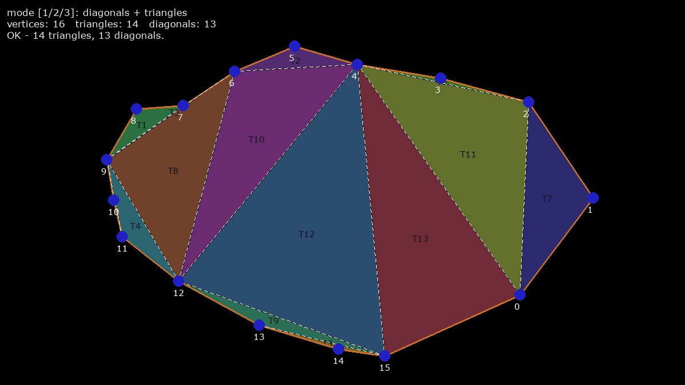
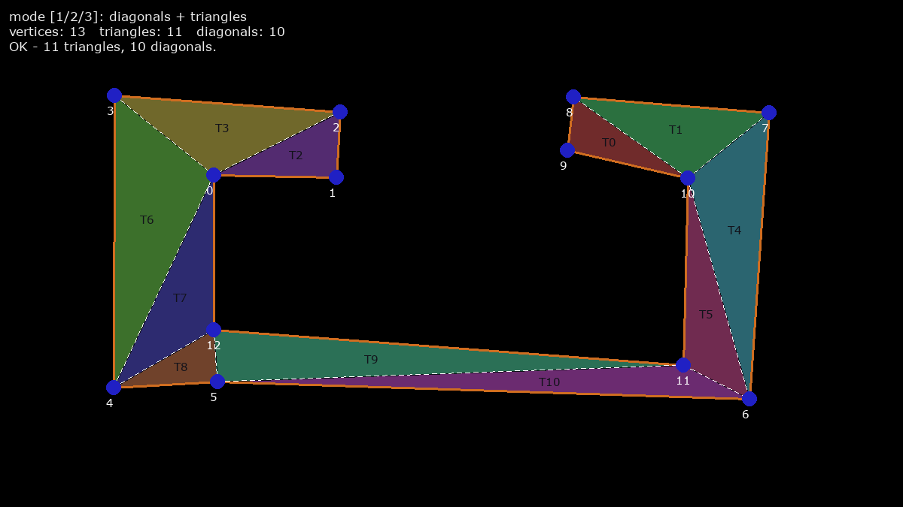
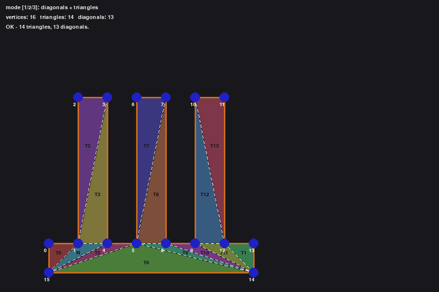
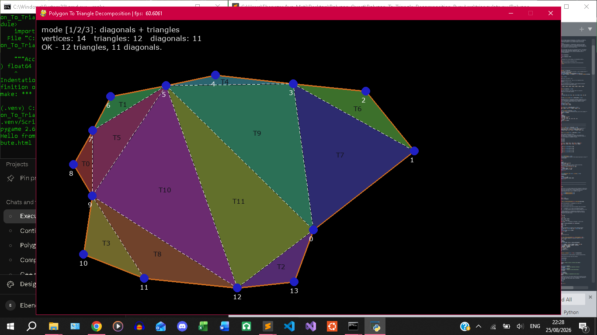

##### Date: 23-08-2026 — 05-09-2026

##### Author: Ebenezer Ayo, Onyebuchi


# Demonstrating a Polygon to Triangle Decomposition Algorithm

+ Utilizing geometric techniques techniques and algorithms to decompose a convex or concave polygon into triangles.


### Github Repo:
[`Git Repo`](https://github.com/OnyebuchiDeji/Polygon_To_Triangle_Decomposition_Pypy)


### Key Features
+ Polygon to Triangle Decomposition.
+ C-acceleration utilizing numpy accumulation functions, e.g. `np.roll`.

### Tech Stack

+ Python, Pygame, NumPy

### References

From the book:

+ "Programming Principles in Computer Graphics, Leendert Ammeraal".

---

### Setup Instruction
>	Install Python
>	Install Pip
>	Install Make either by msys64, on wsl, or Linux environment
1.	Create & Activate Environment:
	-	`python -m venv .venv`
	-	`.venv\Scripts\activate.bat`
2.	Install Dependencies:
	-	`pip install -r requirements.txt`
3.	Run (in root directory):
	-	`make` or `make app`
	+	Or Run using Python if can't install Make:
	-	`python src/main.py`

---

### Architecture Diagram

```
Polygon_To_Triangle_Decomposition_Pypy/
 ├── src/
 │	├── verify_triangulate.py
 │	├── triangulate.py
 │	├── canvas.py
 │	└── app.py
 ├── requirements.txt
 ├── README.md
 ├── Makefile
 ├── gb_info.html
 └── .gitignore
```

### Screenshots





---